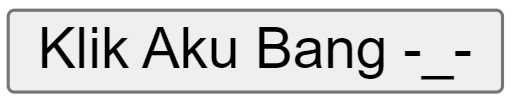

## Anatomi CSS


### Selector
Selector CSS memungkinkan Anda memilih elemen-elemen HTML untuk diberi gaya menggunakan CSS. Dengan selector ini, Anda bisa menentukan elemen mana yang akan dimodifikasi tampilannya secara visual di halaman web.
### Property

Property dalam CSS adalah gaya atau karakteristik yang diterapkan pada elemen HTML untuk mengatur penampilan, seperti warna, ukuran font, dan jarak (margin). Ini digunakan bersama dengan selector untuk mengontrol tampilan dan tata letak elemen di halaman web.
## Percobaan I
### Kode Program
```html
<!DOCTYPE html>
<html>
    <head>
        <title>Belajar CSS 1</title>
        <style>
            p {
                color: red;
            }
        </style>
    </head>
    <body>
        <p>Welcome CSS</p>
    </body>
</html>
```
### Hasil


Penjelasan
- `<!DOCTYPE html>`: Mendefinisikan dokumen sebagai dokumen HTML versi terbaru.
- `<html>`: Elemen root untuk seluruh konten HTML.
- `<head>`: Bagian kepala dokumen yang berisi metadata dan stylesheet.
- `<title>`: Menentukan judul halaman di browser.
- `<style>`: Elemen untuk menulis CSS di dalam dokumen HTML.
- `p { color: red; }`: Mengatur warna teks pada semua elemen `<p>` menjadi merah.
- `<body>`: Bagian utama halaman yang menampilkan konten.
- `<p>Welcome CSS</p>`: Paragraf dengan teks "Welcome CSS" yang warna teksnya diubah menjadi merah dengan CSS internal.

---

## Percobaan II 

Dengan aturan CSS ini, semua tombol `<button>` di halaman akan memiliki gaya yang sama, yaitu lebar 150px, tinggi 50px, teks putih, teks rata kanan, dan latar belakang biru.
### Kode Program
```css
 button {
 width: 150px;
 height: 50px;
 color: white;
 text-align: right;
 background-color: blue; 
 }
```

### Hasil

Before


After


### Penjelasan
- `width: 150px;` : Mengatur lebar tombol menjadi 150 piksel.
- `height: 50px;` : Mengatur tinggi tombol menjadi 50 piksel.
- `color: white;` : Mengatur warna teks tombol menjadi putih.
- `text-align: right;` : Mengatur teks tombol sejajar ke kanan.
- `background-color: blue;`: Warna latar belakang tombol diatur menjadi biru.

---
## Font
### Font-size

Aturan CSS di bawah mengatur ukuran font dari elemen HTML `<p>` menjadi 100 piksel.
#### Kode Program
```css
p{ 
font-size: 100px; 
}
```

#### Hasil
Before


After


#### Penjelasan 

- `p`: Selector CSS yang memilih semua elemen `<p>` (paragraf) di halaman HTML.
- `{ ... }`: Kurung kurawal yang membungkus aturan CSS yang berlaku untuk elemen yang dipilih.
- `font-size: 100px;`: Deklarasi properti CSS yang mengatur ukuran font teks dalam elemen `<p>` menjadi 100 piksel.
---
## Text
### Text Align

CSS di bawah adalah aturan yang mengatur penempatan teks ke tengah (center) pada elemen HTML `<p>`, yaitu paragraf.

#### Kode Program
```css
p{
Text-align: center;
}
```

#### Hasil

Before


After


#### Penjelasan
- `p`: Selector CSS yang memilih semua elemen `<p>` (paragraf) di halaman HTML.
- `{ ... }`: Kurung kurawal yang membungkus aturan CSS yang berlaku untuk elemen yang dipilih.
- `text-align: center;`: Deklarasi properti CSS yang mengatur teks dalam elemen `<p>` agar diratakan ke tengah (center).

---
## Background 

### Background-image 

CSS di bawah adalah aturan yang mendefinisikan gaya untuk elemen HTML `<p>`. Aturan ini menggunakan sebuah gambar sebagai latar belakang untuk elemen `<p>`.
#### Kode Program
```css
p{ 
background-image: url("aset/Hansar.png");
color: white;
}
```

#### Hasil

Before


After


#### Penjelasan

- `p`: Selector CSS yang memilih semua elemen `<p>` (paragraf) di halaman HTML.
- `{ ... }`: Kurung kurawal yang membungkus aturan CSS yang berlaku untuk elemen yang dipilih.
- `background-image: url("aset/hansar.png");`: Deklarasi properti CSS yang mengatur gambar latar belakang elemen `<p>` menggunakan gambar yang terdapat pada path `"aset/nafan.png"`.
- `color: white;` merubah teks menjadi warna putih
---
## Border

### Border Color

CSS di bawah adalah sebuah aturan yang mendefinisikan gaya untuk elemen HTML `<button>`. Aturan ini mengatur warna border (bingkai) dari elemen `<button>` menjadi oranye kemerahan (`orangered`).
#### Kode Program
```css
button{ 
border-color: orangered;
}
```

#### Hasil

Before


After 


#### Penjelasan
mengubah warna bingkai (border) tombol `<button>` menjadi oranye kemerahan (`orangered`).

---
## Padding

### Padding Left

Aturan CSS di atas mengatur jarak (padding) di sebelah kiri dari elemen HTML `<button>` menjadi 29 piksel.
#### Kode Program
```css
button{  
padding-left: 29px; 
}
```

#### Hasil

Before

After


#### Penjelasan
- **Selector**: `button` - Menetapkan elemen HTML `<button>` sebagai target aturan CSS ini.
- **Property**: `padding-left` - Mengontrol jarak (padding) dari sisi kiri elemen.
- **Value**: `29px` - Menyatakan bahwa jarak (padding) di sisi kiri dari elemen `<button>` diatur sebesar 29 piksel.
---
## Margin

### Margin Left

Aturan CSS di bawah mengatur jarak (margin) di sebelah kiri dari elemen HTML `<button>` menjadi 600 piksel.
#### Kode Program
```css
button{
margin-left: 600px;
}
```

#### Hasil

Before


After


#### Penjelasan 
- **Selector**: `button` - Menetapkan elemen HTML `<button>` sebagai target aturan CSS ini.
- **Property**: `margin-left` - Mengontrol jarak (margin) dari sisi kiri elemen.
- **Value**: `600px` - Menyatakan bahwa jarak (margin) di sisi kiri dari elemen `<button>` diatur sebesar 600 piksel.

---
## Background Color
CSS di bawah adalah aturan yang akan diterapkan pada elemen `<button>` ketika tombol tersebut sedang dalam keadaan "hover" (saat kursor mouse mengarah ke atasnya).

```css
button:hover{ 

background-color:red; 
color:white; 
height:100px;
width:100px;

}
```

Hasil
Before


After


#### Penjelasan
- **Selector**: `button:hover` - Mengenali elemen `<button>` saat kursor mouse mengarah ke atasnya (hover).
- **Properties**:
    - `background-color: red;` - Mengubah warna latar belakang tombol menjadi merah saat dihover.
    - `color: white;` - Mengubah warna teks di dalam tombol menjadi putih saat dihover.
    - `height: 100px;` - Menetapkan tinggi tombol menjadi 100 piksel saat dihover.
    - `width: 100px;` - Menetapkan lebar tombol menjadi 100 piksel saat dihover.

---
## Transition

CSS di bawah adalah aturan yang akan mengubah tampilan tombol `<button>` ketika tombol tersebut sedang dalam keadaan "hover" (saat kursor mouse mengarah ke atasnya). Selain itu, aturan ini juga menambahkan efek transisi pada perubahan properti.
### Kode Program
```css
button:hover{
background-color:red;
color:white;
height:100px; 
width:100px; 
transition:all 0.9s ease-in; 
}
```
### Hasil

Before


After

### Penjelasan 

- `background-color: red;` - Mengubah latar belakang tombol menjadi merah saat dihover.
- `color: white;` - Mengubah warna teks di dalam tombol menjadi putih saat dihover.
- `height: 100px;` - Menetapkan tinggi tombol menjadi 100 piksel saat dihover.
- `width: 100px;` - Menetapkan lebar tombol menjadi 100 piksel saat dihover.
- `transition: all 0.9s ease-in;` - Menambahkan efek transisi untuk semua perubahan properti tombol, dengan durasi 0.9 detik dan efek "ease-in" (perubahan lambat di awal dan cepat di akhir).
---
## Transform

CSS di bawah adalah aturan yang akan mengubah transformasi (transform) dari elemen `<button>` ketika tombol tersebut sedang dalam keadaan "hover" (saat kursor mouse mengarah ke atasnya).
### Kode Program
```css
button:hover{
transform:matrix(0.7,-0.5,0.5,0.4,0.5,0.7);
}
```

Hasil
Before


After


### Penjelasan
- **Selector**: `button:hover` - Mengubah tampilan elemen `<button>` saat kursor mouse mengarah ke atasnya (hover).
- **Property**: `transform` - Digunakan untuk melakukan transformasi seperti rotasi, scaling, skewing, dan pemindahan (translation) terhadap elemen.
- **Value**: `matrix(0.7, -0.5, 0.5, 0.4, 0.5, 0.7)` - Menerapkan transformasi matriks khusus ke elemen `<button>`, termasuk scaling (0.7), rotasi, dan skewing (pemiringan).

---
## Flex Direction

CSS di bawah adalah aturan yang mempengaruhi tata letak dari sebuah container yang menggunakan Flexbox dengan class `box-container`. Aturan ini mengubah arah tata letak dari defaultnya menjadi kolom (top to bottom).
### Kode program
```css
    .box-container{ 
    flex-direction: column; 
    }
```

### Hasil


### Penjelasan 
- **Selector**: `.box-container` - Menargetkan elemen dengan class `box-container`. Elemen ini menggunakan Flexbox untuk mengatur tata letak anak-anaknya.
- **Property**: `flex-direction` - Properti CSS dalam Flexbox yang menentukan arah tata letak dari elemen-elemen flex di dalam container.
- **Value**: `column` - Nilai dari properti `flex-direction`, yang mengatur agar anak-anak dari `.box-container` disusun dalam satu kolom dari atas ke bawah.
---
## Align-items

CSS di bawah adalah aturan yang mengatur penempatan vertikal dari elemen-elemen di dalam sebuah container dengan class `.box-container` menggunakan Flexbox.
### Kode Program
```css
.box-container{
align-items:center ;
}
```

### Hasil

Before

Sebelum Menggunakan Align-items : center;


After

Menggunakan Align-items : center;


### Penjelasan
- **Selector**: `.box-container` - Menargetkan elemen dengan class `box-container`, mempengaruhi tampilan anak-anaknya.
- **Property**: `align-items` - Properti Flexbox untuk menengahkan elemen flex secara vertikal di dalam container.
- **Value**: `center` - Nilai yang menengahkan (center) anak-anak dari `.box-container` secara vertikal.
---
## Justify-contet

CSS di bawah adalah aturan yang mengatur penempatan horizontal dari elemen-elemen di dalam sebuah container dengan class `.box-container` menggunakan Flexbox.
```css
.box-container{ 
justify-content: center ; 
}
```

Hasil


### Penjelasan
- **Selector**: `.box-container` - Menargetkan elemen dengan class `box-container`, mempengaruhi tampilan anak-anaknya.
- **Property**: `justify-content` - Properti Flexbox untuk menengahkan elemen flex secara horizontal di dalam container.
- **Value**: `center` - Nilai yang menengahkan (center) anak-anak dari `.box-container` secara horizontal.

---
## Position

CSS di bawah adalah aturan yang akan memengaruhi tampilan dari elemen dengan class 
`box-1`. Berikut adalah penjelasan singkatnya:

### Kode Program
```css
box-1{ 
background-color:aqua;
position:relative;
top:20px; 
left:30px;
}
```

### Hasil


### Penjelasan 

- `background-color: aqua;` - Latar belakang elemen diubah menjadi aqua.
- `position: relative;` - Posisi elemen disesuaikan relatif terhadap posisi normal.
- `top: 20px;` - Geser elemen 20 piksel ke bawah dari posisi normal.
- `left: 30px;` - Geser elemen 30 piksel ke kanan dari posisi normal.